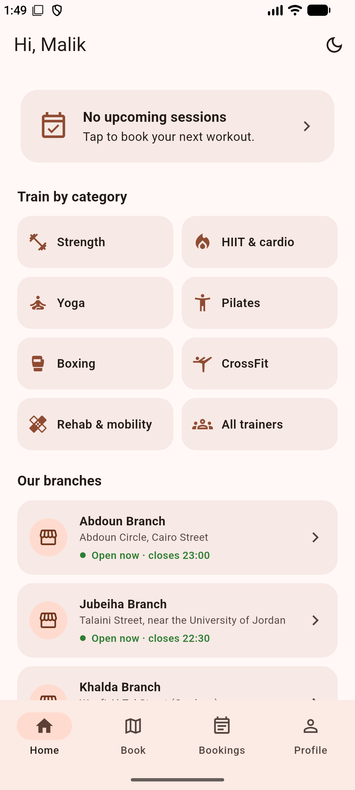
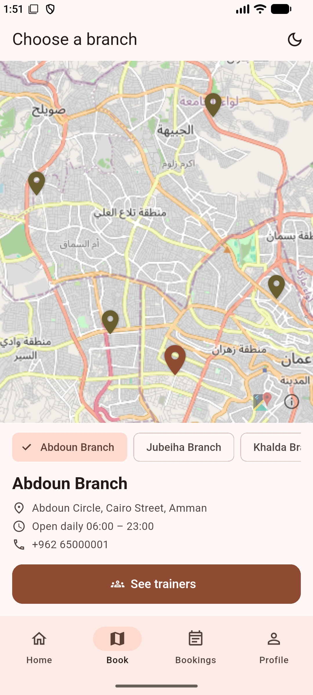
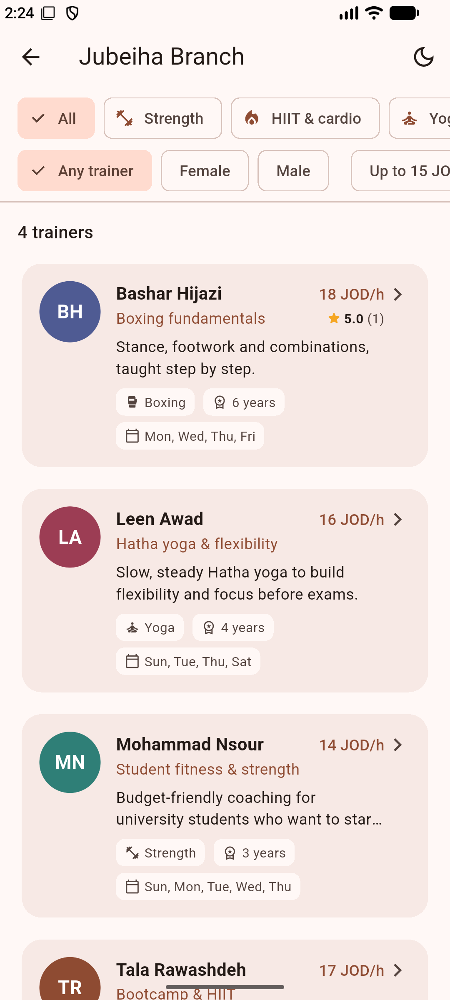
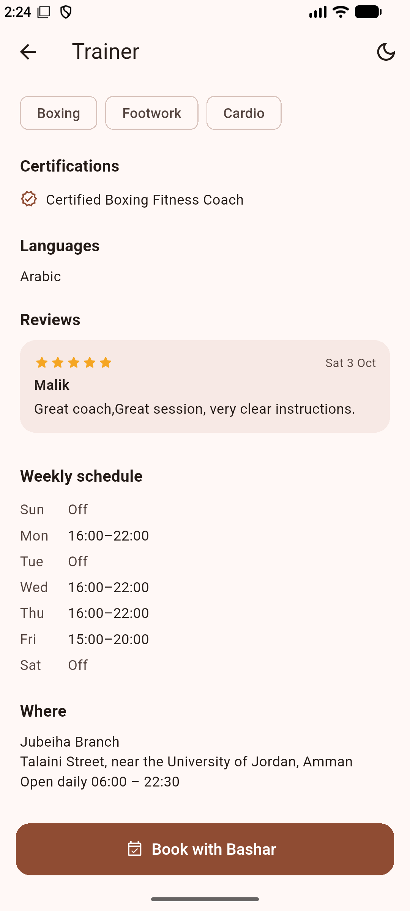
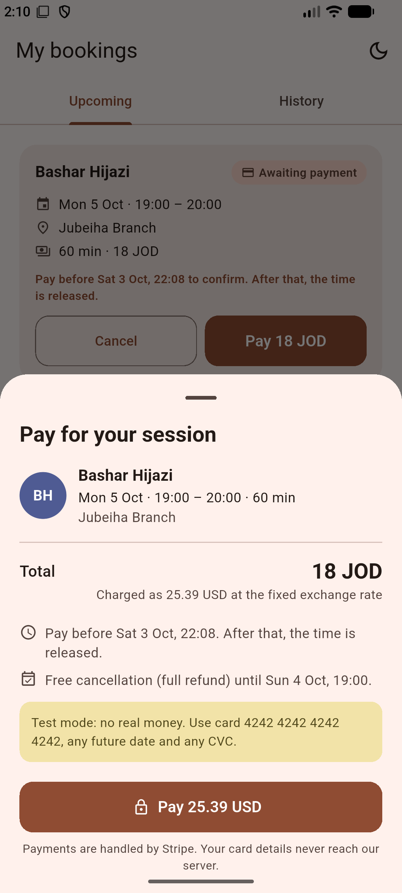
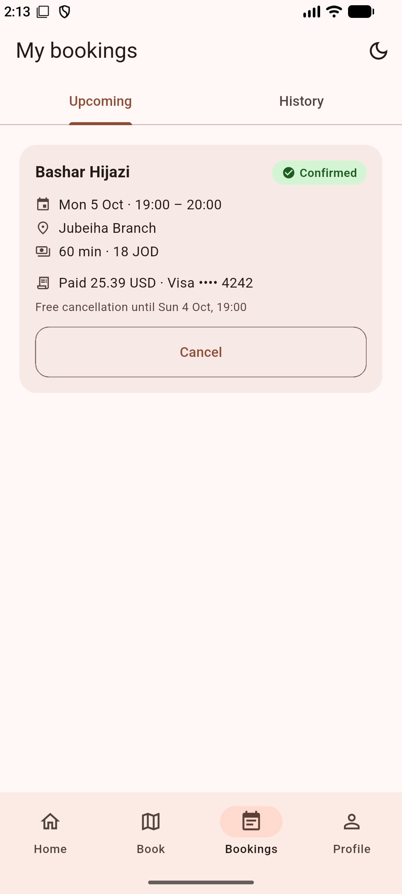
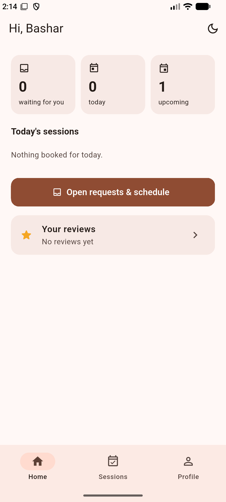
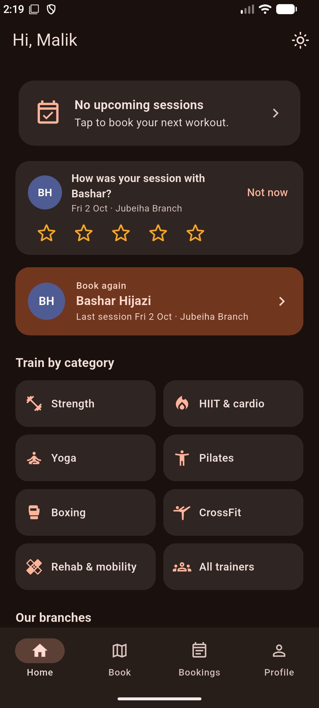
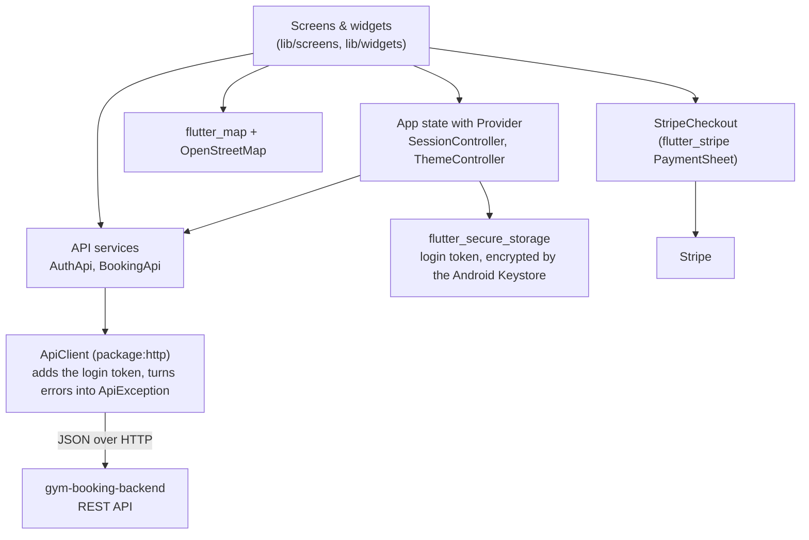

# Gym Booking App

A Flutter app for booking personal-training sessions in a gym chain. Find a branch on the map, compare trainers, pick a free time, and pay once the trainer accepts. Trainers get their own home screen to answer requests and see their day.

[](https://github.com/Malikalqasrawi/gym-booking-app/actions/workflows/ci.yml)


[](LICENSE)

**Backend for this app:** [gym-booking-backend](https://github.com/Malikalqasrawi/gym-booking-backend) (Java 21, Spring Boot, MySQL)

---

<!--
## Screenshots

| Home | Branch map | Trainers + filters | Trainer profile |
|---|---|---|---|
|  |  |  |  |

| Pay with Stripe | My bookings | Trainer home | Dark mode |
|---|---|---|---|
|  |  |  |  |
-->

## What it does

**Members**
- Sign up with an email verification code, then stay logged in (the token is stored encrypted).
- See all 5 branches on an OpenStreetMap map, then the trainers at a branch, filtered by category, gender and price.
- Open a trainer's profile: experience, certifications, languages, weekly schedule.
- Pick a date, a duration (30 to 90 min) and a free start time, and send a request.
- Once the trainer accepts, pay with Stripe's own payment screen (card details never touch our servers).
- Follow everything in **My bookings**: waiting, awaiting payment (with the deadline), confirmed, with receipts and refunds.

**Trainers**
- A home screen with today's sessions and how many requests are waiting.
- Accept or decline requests (with an optional message) and see the upcoming schedule.

**Everyone:** light and dark mode, clear error messages when the network or server is down, pull to refresh.

## Architecture



- **Screens** only show data and react to taps. They never build URLs or parse JSON.
- **Services** (`AuthApi`, `BookingApi`) have one Dart method per backend endpoint and return typed models (`Booking`, `Trainer`, `PaymentStart`...).
- **ApiClient** is the only place that talks HTTP: it adds the `Authorization` header, applies a timeout, and turns every failure into an `ApiException` with a readable message.
- **Rules stay on the server.** The backend says whether a booking `canPay` or `canCancel`, so the app never copies business rules.
- **No secrets in the app.** Anyone can unpack an APK, so the app only knows the backend's address. Stripe's publishable key (public by design) comes from the backend.

## Tech stack

| | |
|---|---|
| Framework | Flutter (stable), Dart 3, Material 3 |
| State | provider (`ChangeNotifier`) |
| Networking | http |
| Storage | flutter_secure_storage (login token), shared_preferences (theme choice) |
| Maps | flutter_map + latlong2, OpenStreetMap tiles |
| Payments | flutter_stripe (PaymentSheet) |
| Quality | flutter_lints (analysis_options.yaml), unit + widget tests, GitHub Actions |

## Getting started

1. **Start the backend** (see [Getting started](https://github.com/Malikalqasrawi/gym-booking-backend#getting-started)). It must answer on port 8080.
2. **Run the app** on an Android emulator:
   ```bash
   git clone https://github.com/Malikalqasrawi/gym-booking-app.git
   cd gym-booking-app
   flutter pub get
   flutter run
   ```
   The emulator reaches your computer at `10.0.2.2`, which is already set in `lib/config/api_config.dart`. For a real phone, put your computer's Wi-Fi IP there.
3. **Log in:**
   - Member: sign up in the app. With the backend in console mode, the verification code is printed in the backend's log.
   - Trainer: `sara.trainer@gym.com` / `Trainer1234` (all 22 demo trainers use this password).
4. **Pay** (Stripe test mode): card `4242 4242 4242 4242`, any future date, any CVC.

## Tests

```bash
flutter analyze   # lint rules from analysis_options.yaml
flutter test      # unit + widget tests
```

The tests cover booking JSON parsing (payment deadline, receipts, refunds), money and date formatting, form validators, and a widget test. GitHub Actions runs both commands on every push and pull request.

## Project structure

```
lib/
├── config/     backend address and timeouts
├── models/     Booking, Trainer, Branch, PaymentStart... (fromJson)
├── services/   ApiClient, AuthApi, BookingApi, secure token storage, StripeCheckout
├── state/      SessionController (who is logged in), ThemeController (light/dark)
├── screens/    auth, booking flow (map, trainers, profile, time), bookings, home, trainer
├── widgets/    shared widgets (BookingCard, TrainerAvatar, LoadError, ...)
├── theme/      Material 3 light and dark themes
└── utils/      dates (gym time zone), money (JOD), validators, messages
```

## Roadmap

- [x] Accounts, email verification, secure login
- [x] Branch map, trainers, profiles, filters, availability
- [x] Booking requests, trainer answers, My bookings
- [x] Stripe payments, receipts, refunds
- [ ] Admin screens
- [ ] Google sign-in

## License

[MIT](LICENSE)
