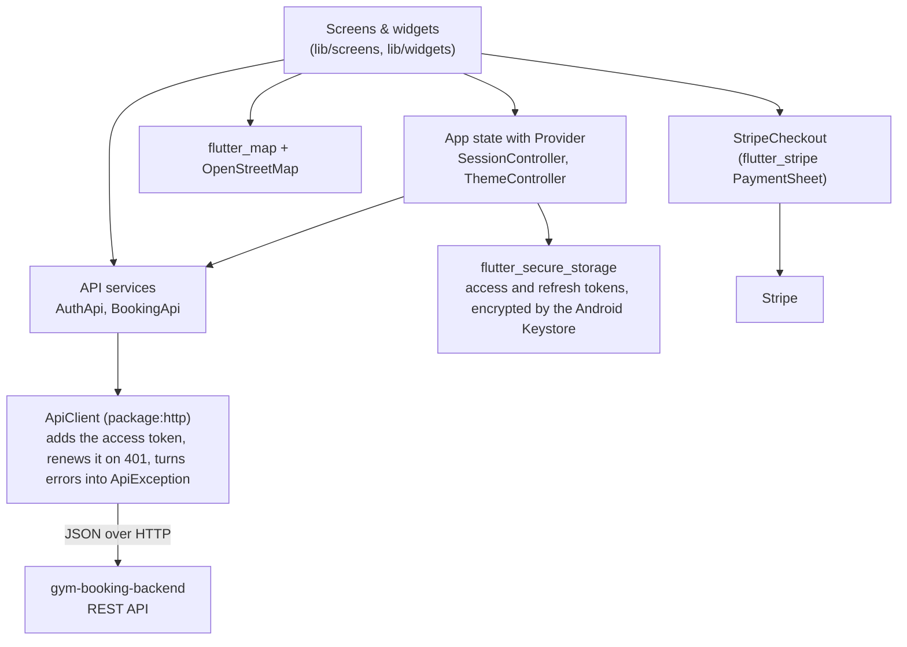

# Gym Booking App

A Flutter app for booking personal-training sessions in a gym chain. Find a branch on the map, compare trainers, pick a free time, and pay once the trainer accepts. Trainers get their own home screen to answer requests and see their day.

[](https://github.com/Malikalqasrawi/gym-booking-app/actions/workflows/ci.yml)


[](LICENSE)

**Backend for this app:** [gym-booking-backend](https://github.com/Malikalqasrawi/gym-booking-backend) (Java 21, Spring Boot, MySQL)

---

<!--
## Screenshots

| Home | Branch map | Trainers + filters | Trainer profile |
|---|---|---|---|
|  |  |  |  |

| Pay with Stripe | My bookings | Trainer home | Dark mode |
|---|---|---|---|
|  |  |  |  |
-->

## What it does

**Members**
- Sign up with an email verification code, or with Google in one tap (the app then asks for a phone number once), then stay logged in for 30 days (the tokens are stored encrypted, and the 15-minute access token is renewed in the background). Forgot the password? Reset it with a code sent by email.
- A home screen with the next session, "Book again" for the trainer of the last session, training categories that list trainers from every branch, and all branches with whether they're open right now.
- See all 5 branches on an OpenStreetMap map, then the trainers at a branch, filtered by category, gender and price.
- Open a trainer's profile: experience, certifications, languages, weekly schedule, star rating and the latest reviews.
- Phone numbers have a country picker (Jordan first) and are checked against that country's rules, so a Jordanian mobile must start with 077, 078 or 079.
- Pick a date, a duration (30 to 90 min) and a free start time, and send a request. Before the first request, the member confirms their phone number with a 6-digit code sent by SMS (again after changing it in Profile).
- Once the trainer accepts, pay with Stripe's own payment screen (card details never touch our servers).
- Follow everything in **My bookings**: waiting, awaiting payment (with the deadline), confirmed, with receipts and refunds.
- If the gym cancels a session, the home screen says so, with the reason and the refund, until dismissed.
- Rate a session with 1 to 5 stars and an optional comment, up to 30 days after it took place (from My bookings, or the card on the home screen). Reviews are final once sent, and profiles show the member's first name and initial only.

**Trainers**
- A home screen with today's sessions and how many requests are waiting.
- Accept or decline requests (with an optional message) and see the upcoming schedule.
- Read their reviews and answer each one; the answer shows under the review and can be edited later.

**Admins**
- Add a trainer with branch, category, rate and profile. The trainer gets an invite code by email, taps "I have an invite code" in the app and chooses their own password.
- Edit profiles and weekly working hours (with split shifts), resend invites, and deactivate or reactivate trainers. Deactivating cancels the trainer's upcoming bookings and refunds paid ones.
- See every booking, upcoming or past, filtered by status and branch, with the member's contact details. Cancel any session before it starts, with an optional message to the member and a full refund if it was paid.
- Block time: close a whole branch or give one trainer time off, for whole days or set hours. The app shows how many bookings that cancels before saving, and members see why a day is closed.
- Add and edit branches, with opening hours and the location picked by tapping the map.
- Read every review and hide one that breaks the rules, with a reason the member is emailed. Hidden reviews don't count toward the trainer's rating and can be shown again.
- Log in with a password and a code from an authenticator app. The first login walks through scanning the QR code and saving the recovery codes.

**Everyone:** a bottom navigation bar with tabs for their role and a Profile tab (phone number, change password, two-factor authentication, log out of all devices), light and dark mode, clear error messages when the network or server is down, pull to refresh. Members and trainers can turn on two-factor authentication with an authenticator app such as Google Authenticator, log in with a recovery code when the phone isn't at hand, and move it to a new phone.

## Architecture



- **Screens** only show data and react to taps. They never build URLs or parse JSON.
- **Services** (`AuthApi`, `BookingApi`) have one Dart method per backend endpoint and return typed models (`Booking`, `Trainer`, `PaymentStart`...).
- **ApiClient** is the only place that talks HTTP: it adds the `Authorization` header, applies a timeout, and turns every failure into an `ApiException` with a readable message.
- **Rules stay on the server.** The backend says whether a booking `canPay` or `canCancel`, so the app never copies business rules.
- **No secrets in the app.** Anyone can unpack an APK, so the app only knows the backend's address. Stripe's publishable key (public by design) comes from the backend.

## Tech stack

| | |
|---|---|
| Framework | Flutter (stable), Dart 3, Material 3 |
| State | provider (`ChangeNotifier`) |
| Networking | http |
| Storage | flutter_secure_storage (login token), shared_preferences (theme choice) |
| Maps | flutter_map + latlong2, OpenStreetMap tiles |
| Payments | flutter_stripe (PaymentSheet) |
| Two-factor setup | qr_flutter (the QR code for the authenticator app) |
| Phone numbers | phone_form_field (country picker and each country's number rules) |
| Google sign-in | google_sign_in (Android Credential Manager, Google Sign-In on iOS) |
| Quality | flutter_lints (analysis_options.yaml), unit + widget tests, GitHub Actions |

## Getting started

1. **Start the backend** (see [Getting started](https://github.com/Malikalqasrawi/gym-booking-backend#getting-started)). It must answer on port 8080.
2. **Run the app** on an Android emulator:
   ```bash
   git clone https://github.com/Malikalqasrawi/gym-booking-app.git
   cd gym-booking-app
   flutter pub get
   flutter run
   ```
   The emulator reaches your computer at `10.0.2.2`, which is already set in `lib/config/api_config.dart`. For a real phone, put your computer's Wi-Fi IP there.
3. **Log in:**
   - Member: sign up in the app. With the backend in console mode, the verification code is printed in the backend's log. So is the SMS code for the phone number, until Twilio is set up in the backend.
   - Trainer: `sara.trainer@gym.com` / `Trainer1234` (all 22 demo trainers use this password).
   - Admin: `admin@gym.com` with the password set in the backend. The first login asks you to scan a QR code with an authenticator app on your phone.
4. **Pay** (Stripe test mode): card `4242 4242 4242 4242`, any future date, any CVC.

### Google sign-in (optional)

Create the Google Cloud clients as described in the [backend README](https://github.com/Malikalqasrawi/gym-booking-backend#google-sign-in-optional). Then, in this project:

1. Copy `google_sign_in.example.json` to `google_sign_in.json` (git-ignored) and put in the Web and iOS client IDs.
2. Run with the IDs: `flutter run --dart-define-from-file=google_sign_in.json`. In Android Studio, add `--dart-define-from-file=google_sign_in.json` to **Run > Edit Configurations > Additional run args**.
3. For iOS, copy `ios/Flutter/GoogleSignIn.xcconfig.example` to `ios/Flutter/GoogleSignIn.xcconfig` (git-ignored) and put in the reversed iOS client ID, which Google uses to return to the app.

Android needs no client ID in the app: Google recognizes it by its package name and the SHA-1 of the signing key. Without the IDs, the Google button says that Google sign-in isn't set up.

## Tests

```bash
flutter analyze   # lint rules from analysis_options.yaml
flutter test      # unit + widget tests
```

The tests cover booking JSON parsing (payment deadline, receipts, refunds), the admin models (trainers, bookings, blocked times, branches), the home screen (cancellation notices, "Book again", branch opening hours), reviews (JSON, ratings, which session to ask about, the rating sheet), money and date formatting, form validators, the API client's token renewal (one shared refresh, logout when refused), the two-factor login steps, Google sign-in and the phone number afterwards, phone numbers by country and the SMS code, and widget tests (password reset, tab switching, two-factor setup and recovery codes, the Google button without client IDs, the phone field with its country picker). GitHub Actions runs both commands on every push and pull request.

## Project structure

```
lib/
├── config/     backend address, timeouts and Google client IDs
├── models/     Booking, Trainer, Branch, PaymentStart... (fromJson)
├── services/   ApiClient, AuthApi, BookingApi, AdminApi, GoogleAuth, secure token storage, StripeCheckout
├── state/      SessionController (who is logged in), ThemeController (light/dark)
├── screens/    admin, auth, booking flow (map, trainers, profile, time), bookings, home, trainer
├── widgets/    shared widgets (BookingCard, TrainerCard, PhoneNumberField, LoadError, ...)
├── theme/      Material 3 light and dark themes
└── utils/      dates (gym time zone), money (JOD), phone numbers, validators, messages
```

## Roadmap

- [x] Accounts, email verification, secure login
- [x] Branch map, trainers, profiles, filters, availability
- [x] Booking requests, trainer answers, My bookings
- [x] Stripe payments, receipts, refunds
- [x] Admin: trainer invites, profiles, schedules, deactivation
- [x] Admin: bookings overview, blocked times, branches
- [x] Sessions that renew themselves, change password, log out of all devices
- [x] Two-factor authentication with an authenticator app
- [x] Google sign-in for members
- [x] Phone numbers by country, confirmed by SMS
- [x] Session reviews, trainer replies and moderation

## License

[MIT](LICENSE)
